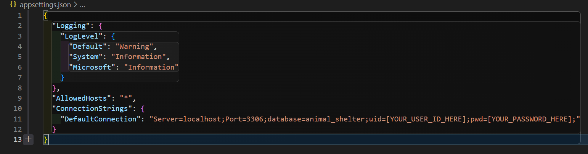

# _Animal Shelter_

#### By _**Sean Keane**_

#### Building an API - Epicodus Code Review 9/9/2022

## Technologies Used

* C#
* .NET 5.0
* ASP.NET Core MVC
* MySQL
* Entity Core Framework
* Identity Core Framework
* AspNet Core Web Api
* Swashbuckle
* XML

## Description
_This is a project I created at Epicodus that keeps track of the animals in Sean's Animal Shelter using MySQL.  The API uses Rest design and utilizes full CRUD functionality to the end user.  The API also utilizes Swagger to present the functionality of the API in a more manageable package.  Developing this API helped grow my understanding of C#, .NET, ASP.NET Core MVC, Databases, Identity Core Framerwork, Entity Core Framework, AspNet Core Web Api, Swashbuckle, and XML._

## Setup/Installation Requirements

1) Download `.NET 5.0` for Windows or Mac OS.
2) Clone this repository to your desktop.
3) Navigate to the now installed directory and open in your editor of choice.
4) Add Microsoft.EntityFrameworkCore with `$ dotnet add package Microsoft.EntityFrameworkCore -v 5.0.0`.
5) Install dotnet-ef globally.  This project was developed using version `Entity Framework Core .NET Command-line Tools 5.0.1`.
6) Within AnimalShelterAPI create a file with `touch appsettings.json` and include the text from the example image below. 

7) Create your own database by using the command `dotnet ef database update`.  This data should now be in your MySQL workbench.
8) Please navigate to your installed directory using `cd AnimalShelterAPI`.
9) To run the project please execute `dotnet run`.
10) To view Swagger Documentation please enter `http://localhost:5000/index.html` into your browser of choice.  Swagger provides examples of the API and the ability to execute GET, POST, GET, PUT, and DELETE commands. 

## For visual representation of a successfully built application, please consult the attached Gif.

## Project can be found at:
https://github.com/CanadianRunner/AnimalShelterAPI.Solution

## Known Bugs

* No known bugs.

## License

If you have any questions or concerns feel free to contact me at code@sean-keane.com

*This is licensed under the MIT license*

Copyright (c) 9-9-2022 **_Sean Keane_**

